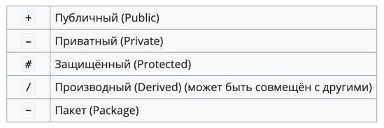

# avaj-launcher

start:\
25\
Fly.Baloon B1 2 3 20\
Fly.Baloon B2 1 8 66\
Fly.JetPlane J1 23 44 32\
Fly.Helicopter H1 654 33 20\
Fly.Helicopter H2 22 33 44\
Fly.Helicopter H3 98 68 99\
Fly.Baloon B3 102 22 34\
Fly.JetPlane J2 11 99 768\
Fly.Helicopter H4 223 23 54\

https://wiki.cologne/%D0%94%D0%B8%D0%B0%D0%B3%D1%80%D0%B0%D0%BC%D0%BC%D0%B0_%D0%BA%D0%BB%D0%B0%D1%81%D1%81%D0%BE%D0%B2